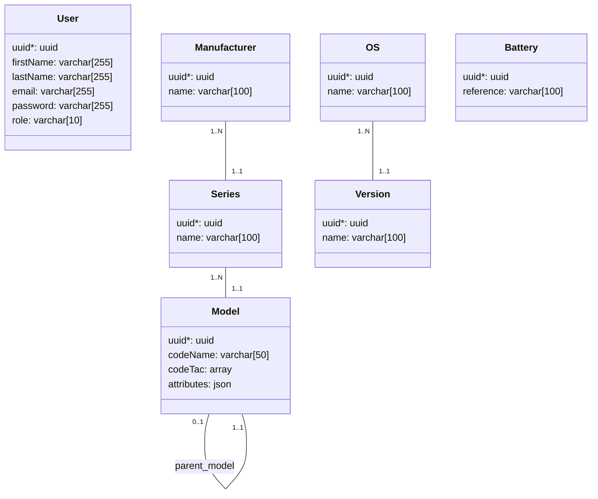

# Database

## Schema

The diagram below will be modified as the schema evolves.



### Device refential examples:

| ID | Parent ID | Manufacturer | Series  | Model (code name)  | Characteristics                                                                                               |
| ---|-----------|--------------|--------------|--------|---------------------------------------------------------------------------------------------------------------|
| 1  | NULL      | Samunsung    | Galaxy       | S7  (123456)   | `[{"type": "alternative_os", "value": "93b5492c-9024-4cb3-9b4a-805a8ba5ac66"}, {"type": "battery": "refABC"}]`|
| 2  | 1         | Samunsung    | Galaxy       | S7 (78910)     | `[{"type": "battery": "refDEF" }, {"type": "image": "https://static.fnac-static.com/multimedia/Images/FR/NR/84/37/77/7812996/1505-1/tsp20160218154530/Smartphone-Samsung-Galaxy-S7-Edge-32-Go-Or.jpg", "property": "front"}]`                                                                            |
| 3  | NULL      | Asus         | Nexus        | 7      | `[{"type": "storage": "128go" }, { "type": "connector", "value": "USB-C" }]`                                  |
| 4  | NULL      | Google       | Pixel        | Pro    | `[{"type": "unlockable": "true"}, {"type": "storage": "128go" }]`                                             |
| 5  | NULL      | Apple        | Iphone       | 13 pro | `[{"type": "unlockable": "false"}]`                                                                           |

## Connection

To connect to the PostgreSQL client, use the command :

```bash
make dbshell
```

## Migrations

When you make changes to doctrine entities as well as mapping files, you must generate a migration so that it is versioned.

To generate a migration, use the command :

```bash
make dbmigration
```

Once the migration is generated, it must be executed. To do this there is the following command which will take all the unplayed migrations and execute them one by one.

```bash
make dbmigrate
```
